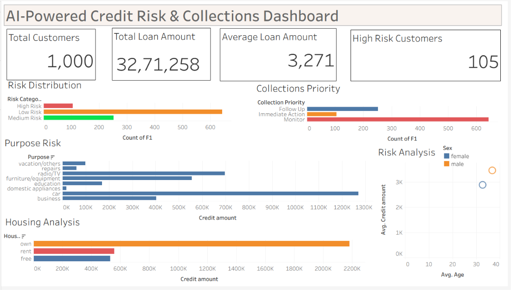

# AI-Powered Credit Risk & Collections Dashboard

## Dashboard Preview

## Project Overview

This Tableau dashboard analyzes customer credit risk, loan exposure, and collections priorities.

## Tools Used

- Tableau Public
- GitHub
- CSV Dataset

## Key Features

- Risk Distribution Analysis
- Collections Priority Monitoring
- Purpose Risk Analysis
- Housing Analysis
- Risk Analysis

## Dataset

German Credit Dataset

## Author

Yashaswi Barde
